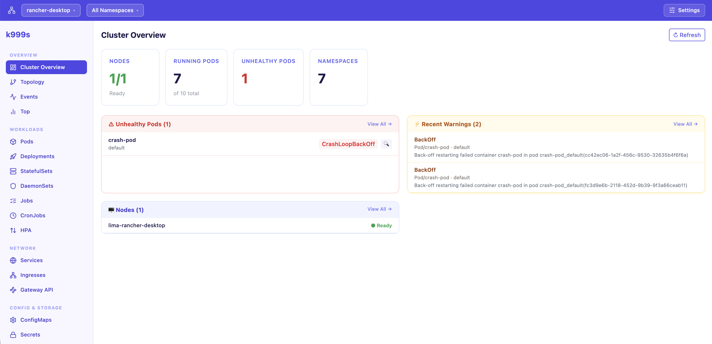

<div align="center">

# k999s

**Local Kubernetes Dashboard — single binary, browser-based, no cluster-side install**

<p>
  <a href="#english">🇬🇧 English</a> &nbsp;·&nbsp;
  <a href="#thai">🇹🇭 ภาษาไทย</a>
</p>




</div>

---

<a name="english"></a>

## 🇬🇧 English

<details open>
<summary><strong>Click to expand / collapse</strong></summary>

### What is k999s?

k999s is a **local Kubernetes dashboard** — a single self-contained binary that embeds a React frontend and serves it at `http://localhost:8080`. It reads your `~/.kube/config` automatically with no cluster-side components required.

Think of it as k9s, but in your browser — with topology graphs, AI-powered diagnostics, and a full resource editor.

---

### Features

| Category | Features |
|---|---|
| **Cluster** | Context switching, namespace filter, real-time WebSocket updates |
| **Workloads** | Pods (container detail, logs, exec, restart, delete), Deployments (scale, rollout restart) |
| **Observability** | Topology graph, Events, Resource Top (CPU/Memory) |
| **Resources** | ConfigMaps, Secrets, Services, Nodes, Namespaces |
| **Explorer** | Browse any K8s resource type (CRDs included), view & edit YAML |
| **AI Diagnostic** | Pod root-cause analysis via Ollama, Anthropic, OpenAI, or OpenRouter |
| **Settings** | AI provider configuration — saved to `~/.k999s/config.yaml` |

---

### Prerequisites

#### Required

| Dependency | Version | Purpose |
|---|---|---|
| A Kubernetes cluster | any | Something to connect to |
| `~/.kube/config` | — | kubeconfig readable by the binary |

> The binary works against any cluster accessible via kubeconfig — local (kind, minikube, Docker Desktop) or remote (EKS, AKS, GKE, on-prem).

#### For building from source

| Dependency | Version |
|---|---|
| Go | 1.21+ |
| Node.js | 18+ |
| npm | 9+ |

#### For AI Diagnostic (optional)

Choose **one** of the following:

| Provider | What you need |
|---|---|
| **Ollama** (local, free) | [Ollama](https://ollama.ai) installed + a pulled model e.g. `ollama pull llama3.2` |
| **Anthropic** | API key from [console.anthropic.com](https://console.anthropic.com) |
| **OpenAI** | API key from [platform.openai.com](https://platform.openai.com) |
| **OpenRouter** | API key from [openrouter.ai](https://openrouter.ai) — access 100+ models |

---

### Installation

#### Option 1 — Download pre-built binary (recommended)

Download the latest release for your platform from the [Releases](../../releases) page:

```bash
# macOS Apple Silicon
curl -L https://github.com/FixHarDeZ/k999s-dashboard/releases/latest/download/k999s_darwin_arm64.tar.gz | tar xz
sudo mv k999s /usr/local/bin/

# macOS Intel
curl -L https://github.com/FixHarDeZ/k999s-dashboard/releases/latest/download/k999s_darwin_amd64.tar.gz | tar xz
sudo mv k999s /usr/local/bin/

# Linux amd64
curl -L https://github.com/FixHarDeZ/k999s-dashboard/releases/latest/download/k999s_linux_amd64.tar.gz | tar xz
sudo mv k999s /usr/local/bin/
```

#### Option 2 — Build from source

```bash
# 1. Clone
git clone https://github.com/FixHarDeZ/k999s-dashboard.git
cd k999s-dashboard

# 2. Install frontend dependencies
cd web && npm install && cd ..

# 3. Build (frontend → Go binary)
make build

# 4. (Optional) install to PATH
sudo mv k999s /usr/local/bin/
```

The output is a single `~47 MB` self-contained binary — no runtime dependencies.

---

### Running

```bash
# Start with default kubeconfig (~/.kube/config)
k999s

# Specify port
k999s --port 9090

# Specify kubeconfig
k999s --kubeconfig /path/to/your/kubeconfig

# Print version
k999s --version
```

The browser opens automatically at `http://localhost:8080`.

---

### AI Diagnostic Setup

Configure your preferred AI provider via the **Settings** page in the sidebar, or edit `~/.k999s/config.yaml` directly:

```yaml
ai:
  provider: ollama          # ollama | anthropic | openai | openrouter
  model: llama3.2           # model name for the chosen provider
  api_key: ""               # required for anthropic / openai / openrouter
  base_url: ""              # optional — override API base URL
```

**Provider examples:**

```yaml
# Ollama (local, free — recommended for privacy)
ai:
  provider: ollama
  model: llama3.2

# OpenRouter (access Claude, Gemini, GPT-4 and more)
ai:
  provider: openrouter
  model: anthropic/claude-sonnet-4-5
  api_key: sk-or-...

# Anthropic Claude
ai:
  provider: anthropic
  model: claude-sonnet-4-6
  api_key: sk-ant-...

# OpenAI
ai:
  provider: openai
  model: gpt-4o
  api_key: sk-...
```

Settings are hot-reloaded — no restart required after saving from the UI.

---

### Usage Guide

#### Switching Contexts & Namespaces

Use the dropdowns in the top bar to switch between kubeconfig contexts and filter by namespace. All pages update automatically.

#### Pods

- Click **▶** on a pod row to expand container details (type, state, restart count)
- **Logs** — stream real-time or previous logs; select container from dropdown
- **Exec** — open an interactive terminal in any container
- **AI** — run AI diagnostic to get root-cause analysis of a failing pod
- **Restart / Delete** — actions with confirmation prompt

#### Topology

- Visual graph of Deployments, Services, Pods, and Ingresses in the selected namespace
- Red nodes indicate unhealthy resources — click to view container error states
- **AI Diagnose** button on error nodes launches diagnostic panel

#### Resource Explorer

- Browse every resource type in your cluster (including CRDs)
- **Full** view shows complete YAML; **Clean** view strips server-managed fields (like `kubectl edit`)
- Edit and apply changes directly from the browser

#### AI Diagnostic

- Opens as a slide-over panel
- Streams analysis token-by-token from your configured AI provider
- Collects pod logs + events before sending to AI for context

---

### Development

```bash
# Hot-reload dev mode (Go :8080 + Vite :5173)
make dev

# Run all tests
make test

# Go tests only
go test ./...

# Frontend tests only (must run from web/)
cd web && npx vitest run

# Lint
golangci-lint run
```

</details>

---

<a name="thai"></a>

## 🇹🇭 ภาษาไทย

<details>
<summary><strong>คลิกเพื่อขยาย / ย่อ</strong></summary>

### k999s คืออะไร?

k999s คือ **Kubernetes Dashboard แบบ local** — binary ไฟล์เดียวที่ embed React frontend ไว้ภายใน เปิดใช้งานที่ `http://localhost:8080` อ่าน `~/.kube/config` โดยอัตโนมัติ ไม่ต้องติดตั้งอะไรเพิ่มใน cluster

คิดว่ามันคือ k9s แต่ทำงานผ่าน browser — มี topology graph, AI วิเคราะห์ error และ resource editor แบบเต็มรูปแบบ

---

### ฟีเจอร์ทั้งหมด

| หมวด | ฟีเจอร์ |
|---|---|
| **Cluster** | สลับ Context, กรอง Namespace, อัปเดต real-time ผ่าน WebSocket |
| **Workloads** | Pods (ดู container, logs, exec, restart, delete), Deployments (scale, rollout restart) |
| **Observability** | Topology graph, Events, Resource Top (CPU/Memory) |
| **Resources** | ConfigMaps, Secrets, Services, Nodes, Namespaces |
| **Explorer** | Browse ทุก resource type ใน cluster (รวม CRD), ดู & แก้ YAML |
| **AI Diagnostic** | วิเคราะห์ root cause ของ pod ที่พัง ผ่าน Ollama, Anthropic, OpenAI, หรือ OpenRouter |
| **Settings** | ตั้งค่า AI provider — บันทึกลง `~/.k999s/config.yaml` |

---

### สิ่งที่ต้องมีก่อนใช้งาน

#### จำเป็นต้องมี

| สิ่งที่ต้องการ | รายละเอียด |
|---|---|
| Kubernetes cluster | cluster ที่ connect ได้ (local หรือ cloud) |
| `~/.kube/config` | kubeconfig ที่ binary อ่านได้ |

> ใช้งานได้กับทุก cluster ที่ access ผ่าน kubeconfig ได้ — local (kind, minikube, Docker Desktop) หรือ cloud (EKS, AKS, GKE, on-prem)

#### สำหรับ build จาก source code

| เครื่องมือ | Version |
|---|---|
| Go | 1.21+ |
| Node.js | 18+ |
| npm | 9+ |

#### สำหรับ AI Diagnostic (ไม่บังคับ)

เลือก **หนึ่ง** provider ต่อไปนี้:

| Provider | สิ่งที่ต้องเตรียม |
|---|---|
| **Ollama** (รันใน local, ฟรี) | ติดตั้ง [Ollama](https://ollama.ai) + pull model เช่น `ollama pull llama3.2` |
| **Anthropic** | API key จาก [console.anthropic.com](https://console.anthropic.com) |
| **OpenAI** | API key จาก [platform.openai.com](https://platform.openai.com) |
| **OpenRouter** | API key จาก [openrouter.ai](https://openrouter.ai) — ใช้ได้กว่า 100 model |

---

### การติดตั้ง

#### วิธีที่ 1 — ดาวน์โหลด binary สำเร็จรูป (แนะนำ)

ดาวน์โหลด release ล่าสุดจากหน้า [Releases](../../releases):

```bash
# macOS Apple Silicon (M1/M2/M3/M4)
curl -L https://github.com/FixHarDeZ/k999s-dashboard/releases/latest/download/k999s_darwin_arm64.tar.gz | tar xz
sudo mv k999s /usr/local/bin/

# macOS Intel
curl -L https://github.com/FixHarDeZ/k999s-dashboard/releases/latest/download/k999s_darwin_amd64.tar.gz | tar xz
sudo mv k999s /usr/local/bin/

# Linux amd64
curl -L https://github.com/FixHarDeZ/k999s-dashboard/releases/latest/download/k999s_linux_amd64.tar.gz | tar xz
sudo mv k999s /usr/local/bin/
```

#### วิธีที่ 2 — Build จาก source code

```bash
# 1. Clone project
git clone https://github.com/FixHarDeZ/k999s-dashboard.git
cd k999s-dashboard

# 2. ติดตั้ง frontend dependencies
cd web && npm install && cd ..

# 3. Build (frontend → Go binary)
make build

# 4. (ไม่บังคับ) ติดตั้งไว้ใน PATH
sudo mv k999s /usr/local/bin/
```

ผลลัพธ์คือ binary ไฟล์เดียวขนาดประมาณ `~47 MB` ที่รันได้เลยโดยไม่ต้องพึ่ง dependency อื่น

---

### การรันโปรแกรม

```bash
# รันด้วย kubeconfig ค่าเริ่มต้น (~/.kube/config)
k999s

# ระบุ port
k999s --port 9090

# ระบุ kubeconfig
k999s --kubeconfig /path/to/your/kubeconfig

# ดู version
k999s --version
```

browser จะเปิดขึ้นมาอัตโนมัติที่ `http://localhost:8080`

---

### ตั้งค่า AI Diagnostic

ตั้งค่าผ่านหน้า **Settings** ใน sidebar หรือแก้ไฟล์ `~/.k999s/config.yaml` โดยตรง:

```yaml
ai:
  provider: ollama          # ollama | anthropic | openai | openrouter
  model: llama3.2           # ชื่อ model ของ provider ที่เลือก
  api_key: ""               # จำเป็นสำหรับ anthropic / openai / openrouter
  base_url: ""              # ไม่บังคับ — override API base URL
```

**ตัวอย่างตาม provider:**

```yaml
# Ollama (local, ฟรี — แนะนำสำหรับ privacy)
ai:
  provider: ollama
  model: llama3.2

# OpenRouter (ใช้ Claude, Gemini, GPT-4 และอื่นๆ)
ai:
  provider: openrouter
  model: anthropic/claude-sonnet-4-5
  api_key: sk-or-...

# Anthropic Claude
ai:
  provider: anthropic
  model: claude-sonnet-4-6
  api_key: sk-ant-...

# OpenAI
ai:
  provider: openai
  model: gpt-4o
  api_key: sk-...
```

การตั้งค่า hot-reload ทันที — **ไม่ต้อง restart** หลังจาก save จาก Settings UI

---

### คู่มือการใช้งาน

#### สลับ Context และ Namespace

ใช้ dropdown ใน top bar เพื่อสลับ kubeconfig context และกรอง namespace ทุกหน้าจะอัปเดตอัตโนมัติ

#### หน้า Pods

- กด **▶** ที่แถว pod เพื่อดู container ย่อย (ประเภท, state, restart count)
- **Logs** — ดู log แบบ real-time หรือ log ก่อนหน้า, เลือก container จาก dropdown
- **Exec** — เปิด terminal แบบ interactive ใน container
- **AI** — รัน AI วิเคราะห์ root cause ของ pod ที่มีปัญหา
- **Restart / Delete** — action ที่มี confirmation ก่อนทำ

#### หน้า Topology

- แสดง graph ของ Deployments, Services, Pods, และ Ingresses ใน namespace ที่เลือก
- กล่องสีแดง = resource ที่มีปัญหา — กดเพื่อดู container error states
- ปุ่ม **AI Diagnose** บน error node เปิด diagnostic panel ได้เลย

#### Resource Explorer

- Browse ทุก resource type ใน cluster (รวม CRD)
- **Full** view แสดง YAML ทั้งหมด; **Clean** view ตัด server-managed fields ออก (เหมือน `kubectl edit`)
- แก้ไขและ apply การเปลี่ยนแปลงได้จาก browser โดยตรง

#### AI Diagnostic

- เปิดเป็น slide-over panel ทางขวา
- Stream การวิเคราะห์แบบ token-by-token จาก AI provider ที่ตั้งค่าไว้
- รวบรวม pod logs + events ก่อนส่งให้ AI เพื่อบริบทในการวิเคราะห์

---

### สำหรับนักพัฒนา

```bash
# Hot-reload dev mode (Go :8080 + Vite :5173)
make dev

# รัน test ทั้งหมด
make test

# Go test เท่านั้น
go test ./...

# Frontend test เท่านั้น (ต้องรันจาก web/)
cd web && npx vitest run

# Lint
golangci-lint run
```

</details>

---

<div align="center">
<sub>Built with Go + React · MIT License</sub>
</div>
